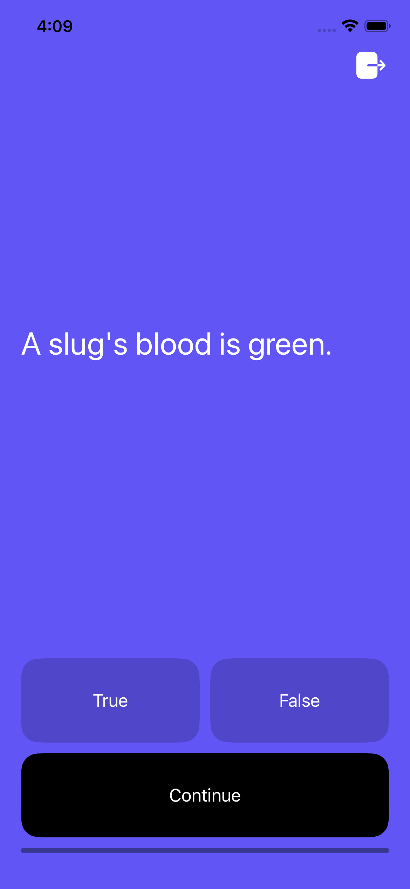
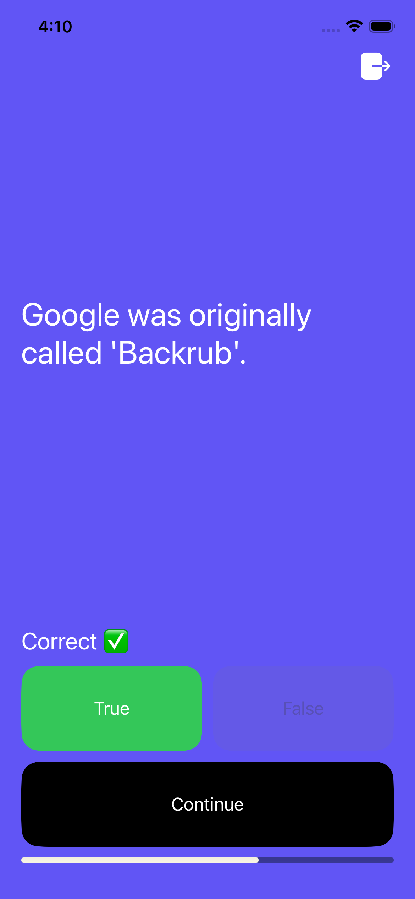
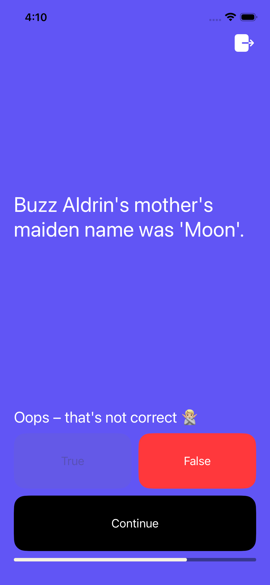

# Quizzler

A simple True/False trivia quiz app for iOS. Answer a series of questions, see instant feedback, and track your progress through the quiz.

Built entirely with **UIKit** using **programmatic UI** — no Storyboards for the main app flow. The root view controller is set up in code via `SceneDelegate`.

## Screenshots

| Question | Correct answer | Wrong answer |
|----------|----------------|--------------|
|  |  |  |

## Features

- True/False trivia questions
- Instant feedback (correct ✅ / incorrect 🙅🏼‍♂️)
- Visual highlight on the selected answer (green for correct, red for wrong)
- Progress bar at the bottom of the quiz
- Logout button in the top-right corner

## Getting Started

1. Open `Quizzler.xcodeproj` in Xcode.
2. Select an iPhone simulator (or a connected device).
3. Build and run (`⌘R`).

### Login / Firebase

Account sign-in and Firebase integration are **not working at the moment**. To use the app, tap **Log in as a guest** on the login screen.

## Requirements

- Xcode
- iOS Simulator or a physical iPhone

## Tech Stack

- Swift
- UIKit (programmatic layout with Auto Layout)
- UINavigationController for screen navigation
